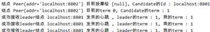

# 项目笔记

项目相关的原理我总结在[基于Raft的分布式项目笔记](https://blog.csdn.net/weixin_41519463/article/details/104057535)

# 测试

## 准备阶段

使用IntelliJ IDEA，打开项目后，等待依赖自动下载完毕。

然后按照[idea报错：Error：java不支持发行版本5的解决方法](https://www.cnblogs.com/wqy0314/p/11726107.html)操作，先配置好IDEA的Java编译器版本设定。

接着配置 5 个 application 启动项：


这是模拟分布式系统中的五个服务器节点。它们都使用Test类来启动，但`VM options`参数（JVM运行参数）不同，格式是（ `-D`+`serverPort=`+`端口号`），参考Test类中的代码：

```Java
    System.out.println(System.getProperty("serverPort"));
    String[] peerAddr ={"localhost:8801","localhost:8802","localhost:8803",         "localhost:8804","localhost:8805"};
    NodeConfig config = new NodeConfig();
    // 自身节点
    config.setSelfPort(Integer.valueOf(System.getProperty("serverPort")));
    // 其他节点地址
    config.setPeerAddrs(Arrays.asList(peerAddr));
    final Node node = new NodeImpl();
    node.setConfig(config);
    node.init();
```

可见Test类是通过`System.getProperty("serverPort")`的方法取到这个参数。所以这五个Application只需要设置端口号从8801到8805即可。注意要勾上右上角的`Allow parallel run`。


## 开始测试

启动类为Test.java，依次启动5个服务器节点（端口号分别为8801，8802，8803，8804，8805）开始测试。

**测试leader 选举**

五个节点依次启动，几秒过后，节点8801开始竞选，其运行日志如下：


可见8801成为candidate并给其他结点发送选举请求，在得到四张选票后，8801成为leader，并开始向其它4个结点周期性地发送心跳，维持自己的地位：


 

而其它结点启动后的运行日志如下（以8802为例）：



可见8802收到选举请求时，由于candidate 8801的term ID=1比自己的term ID=0要大，且此前没有投过票，因此它给8801投票，8801当选后，8802成为follower，并周期性的接收leader的心跳。

 

由于以上部分都没有客户端请求，没有日志记录，所以日志部分都显示为null。

 

**测试重新选举**

此时我们关闭8801节点，则其它4个节点收不到leader的心跳，大约 15 秒后，重新开始选举。由于各个节点设置的超时时间不同（故意用随机算法错开，避免大量节点同时超时），因此会出现各个节点依次超时、参与竞选的情况。其中经过两轮无效选举（没有server得到多数票）后，第三轮选举的结果是8803获得多数票，成为新leader，随后向其它server发送心跳信号阻止新的选举，8803的运行日志如下：


可见由于8801被关闭了，所以发送给8801的心跳RPC失败。而其他三个server都能收到心跳信号。

 

其他结点比如8804在投票给8803使其成为leader后，自己收到心跳信号，成为follower，8804运行结果如下：


随后重启8801，则8801也成为leader 8803 的follower。

 

**测试PUT、GET、单调写、leader失效、DEL**

**客户端：**

1、readClient：模拟客户端依次向所有服务器结点发送GET请求，获取服务器存储中key为a的value。

2、testClient1和testClient2：模拟两个请求内容相同的客户端向服务器8801（leader）发送请求，即先发送GET请求，获取服务器存储中key为a的value，然后发送PUT请求修改其value。具体来说，如果键值对为空，则设key为a的value为0；键值对不为空，则令key为a的value加1。

3、deleteClient：模拟客户端向服务器8801（leader）发送DEL请求，删除key为a的键值对。

**服务端：**

重新启动五个服务器结点，8801为leader，8802~8805为follower。

 

**测试PUT和GET**

先运行testClient1创建键值对，使key为a的value=0，testClient1客户端的运行结果如下图所示：


然后运行readClient，向所有服务器发送GET请求，获取服务器存储中key为a的value，readClient客户端的运行结果如下图所示：

 

可见key为a的键值对的value在所有服务器结点上是一致的， 其中follower 8802收到readClient的请求后，会将请求重定向到leader 8801处，其他follower同理，下图为follower 8802处理重定向的log：


 

**测试单调写**

经过上面的客户端请求后a=0，此时同时启动testClient1和testClient2，都对a的value进行加一操作，testClient1和testClient2的运行结果如下：


可见a经过两次加一操作后最终value为2，

其中leader 8801对testClient1和testClient2的请求的处理过程如下：


可见leader依次处理了两个客户端的请求，并把加一操作应用到状态机上。最后运行readClient，验证各服务器结点数据是否一致，readClient的运行结果如下图：


可见两个客户端的加一操作都已经应用到各结点的状态机上，数据一致，都为a=2。

 

**测试leader失效**：

接下来测试leader失效后能否保持一致性，经过上面的客户端请求后，现在a=2。此时关闭leader 8801，经过重新选举后，8804成为新的leader。随后运行readClient，查询结果如下：


可见向8801请求失败，而其他结点都保持a=2。接着运行testClient1，向leader 8804发送请求，使a的value加1，testClient1运行结果如下：


此时重启8801，然后再次运行readClient向所有结点发送GET请求查询a的value，readClient的查询结果如下：


可见重启后的8801中a的value也为3，保持与其他结点一致。验证了leader失效、重新选举、结点重启后，系统中各个结点的状态机仍能保持数据一致性。

 

 

**测试DEL**

运行deleteClient，向leader 8804发送DEL请求，删除key为a的键值对，deleteClient的运行结果如下：


其中leader 8804的处理过程如下：


可见leader先将命令写入日志，然后给follower发送日志，最后将命令应用到状态机中，删除此键值对。此时运行readClient查询各结点key为a的value，运行结果如下：


可见key为a的键值对在所有结点的状态机中都被删去了。


